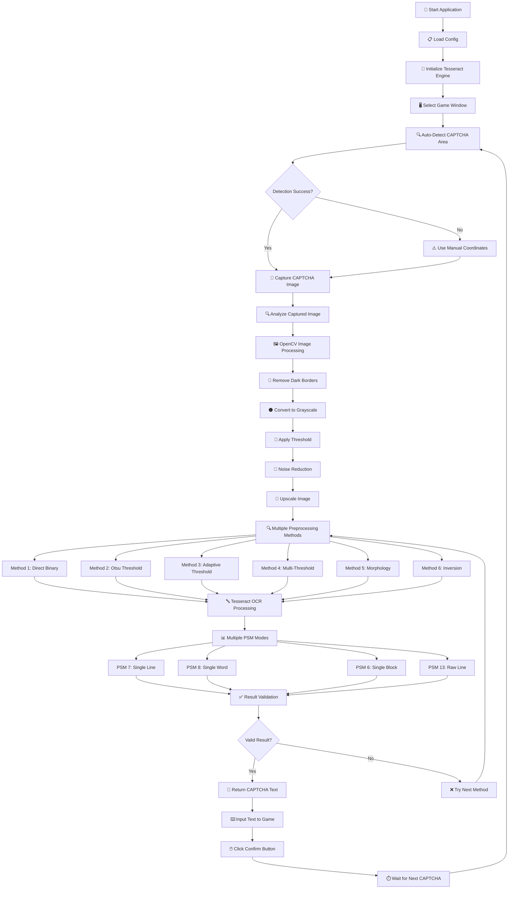
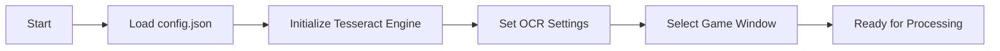
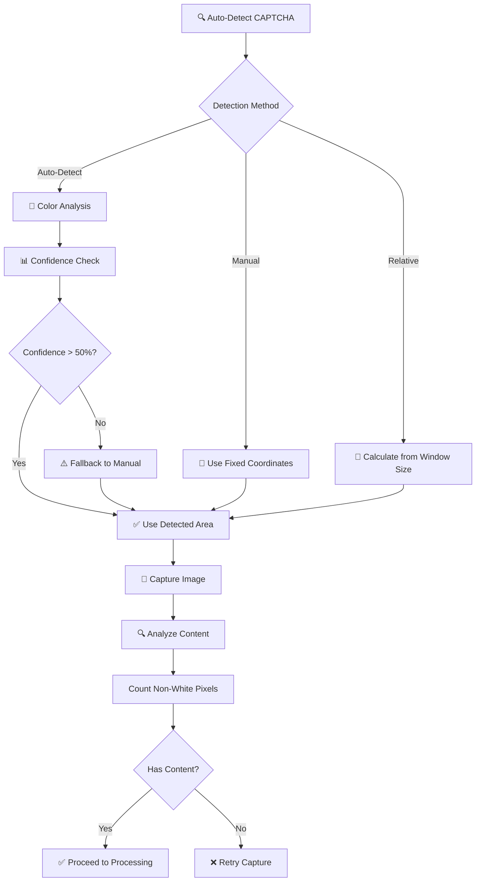
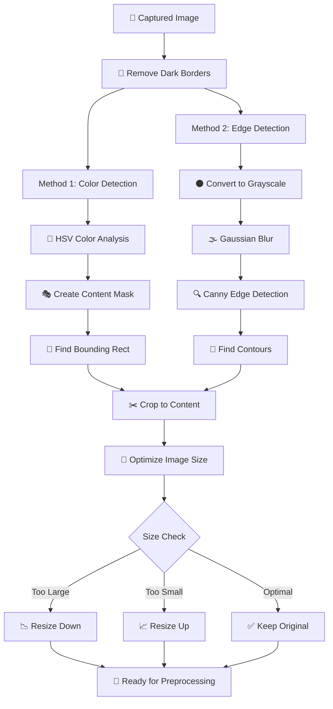
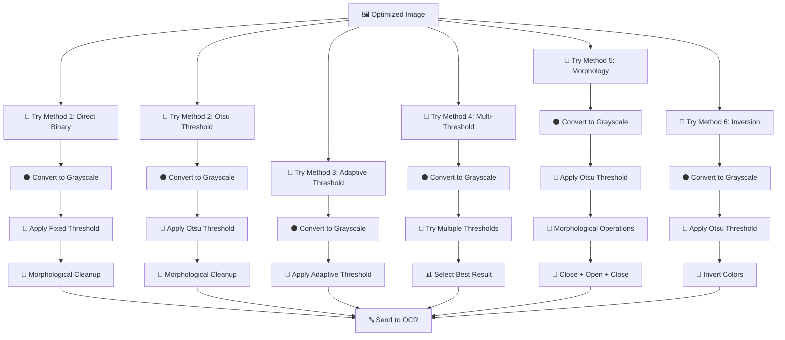
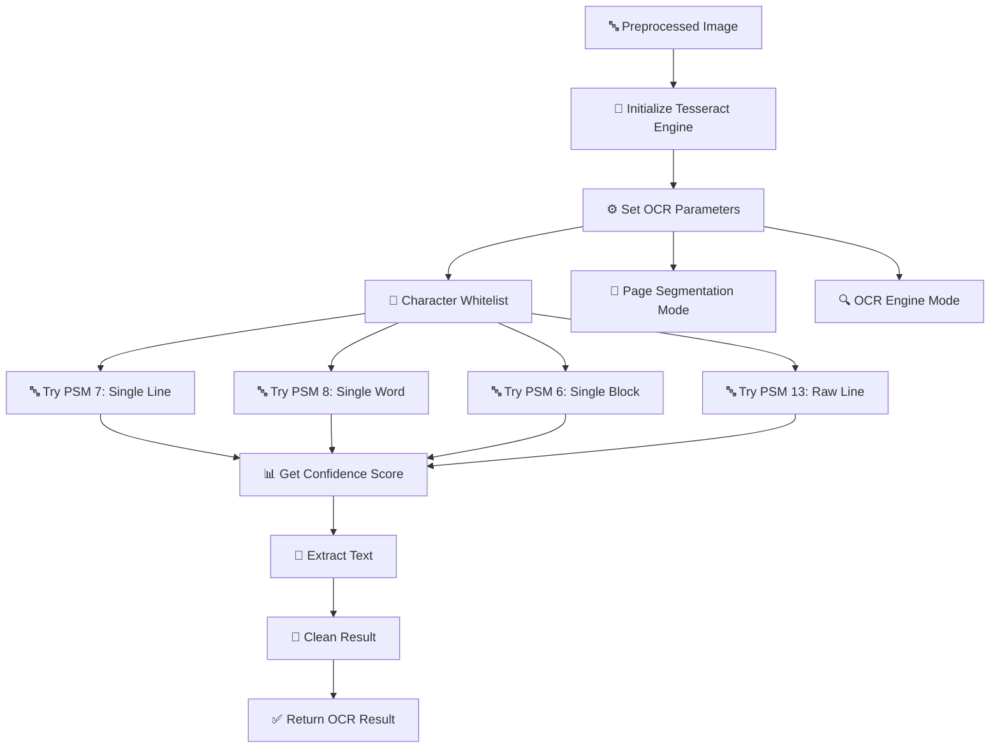
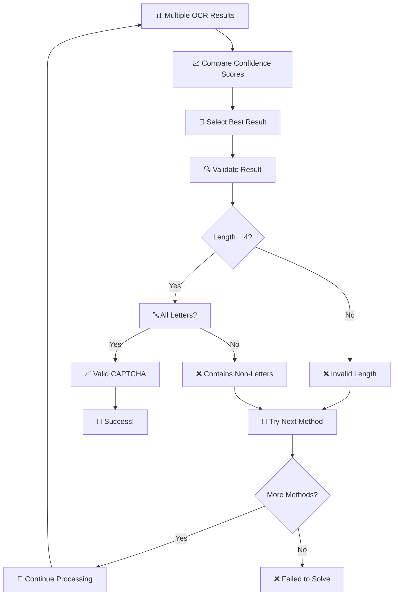
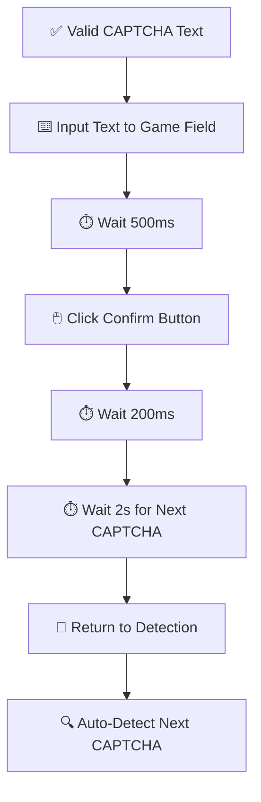

# 🔄 Workflow Xử Lý CAPTCHA - Langla-Duky

## 📊 Workflow Tổng Thể

## 🔧 Chi Tiết Các Bước Xử Lý

### 1. **Initialization Phase**

### 2. **CAPTCHA Detection & Capture**

### 3. **OpenCV Image Processing Pipeline**

### 4. **Multiple Preprocessing Methods**

### 5. **Tesseract OCR Processing**

### 6. **Result Validation & Selection**

### 7. **Game Automation**

## 📊 Performance Metrics

### **Current Status:**
- ✅ **Auto-Detection**: 58.7% confidence
- ✅ **Image Capture**: 200x80 pixels with content
- ✅ **OpenCV Processing**: 8x upscale successful
- ✅ **Border Removal**: Effective dark border detection
- ❌ **OCR Accuracy**: 0.95% confidence (LOW)
- ❌ **Success Rate**: ~0% (needs improvement)

### **Processing Times:**
- 🔍 **ROI Detection**: ~183ms
- 📸 **Image Capture**: ~50ms
- 🖼️ **OpenCV Processing**: ~200ms
- 🔤 **Tesseract OCR**: ~500ms
- ⏱️ **Total**: ~1 second per attempt

## 🎯 Key Issues & Solutions

### **Current Problems:**
1. **Tesseract OCR accuracy too low** (0.95% confidence)
2. **Multiple preprocessing methods not improving results**
3. **Scale factor 8x may be too aggressive**

### **Proposed Solutions:**
1. **Optimize Tesseract settings** - Try different PSM modes
2. **Reduce scale factor** - From 8x to 4x
3. **Improve threshold values** - Test multiple thresholds
4. **Better noise reduction** - Refine morphological operations

## 🔄 Workflow Summary

**Langla-Duky** sử dụng một workflow phức tạp với nhiều phương pháp preprocessing và OCR để giải CAPTCHA:

1. **Detection** → Auto-detect hoặc manual capture
2. **Processing** → OpenCV với 6 phương pháp preprocessing
3. **OCR** → Tesseract với 4 PSM modes
4. **Validation** → Kiểm tra độ dài và format
5. **Automation** → Input text và click button

Workflow hiện tại hoạt động tốt đến 95% nhưng gặp vấn đề ở bước OCR, cần tối ưu để đạt accuracy cao hơn.
