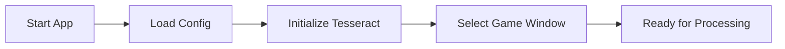
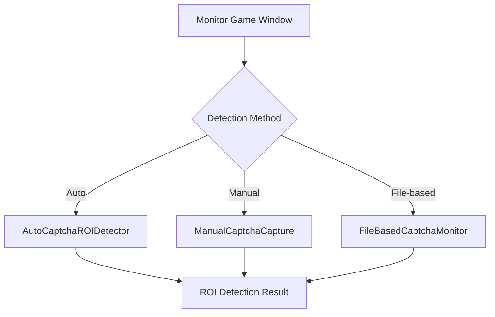
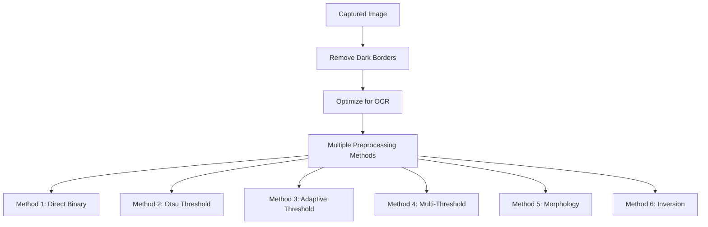
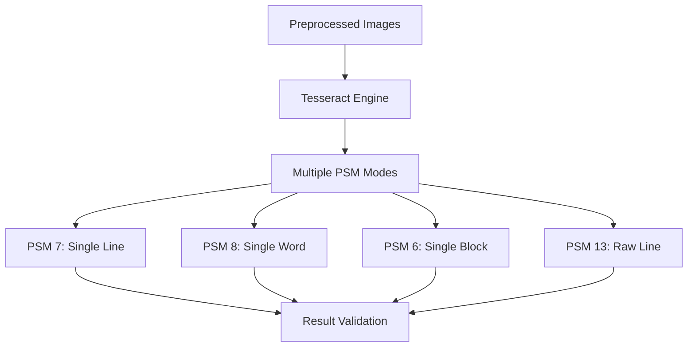
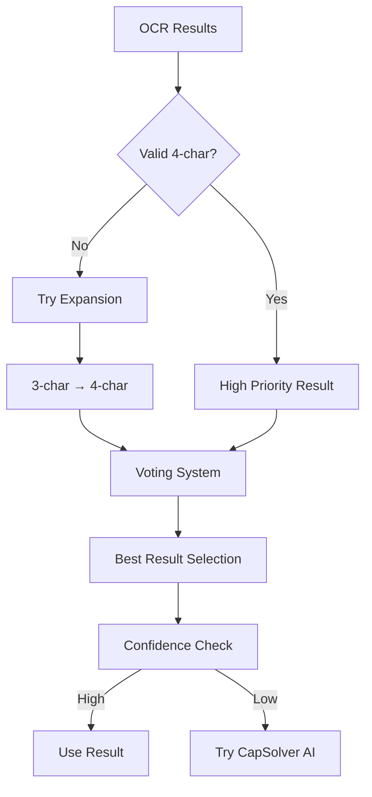
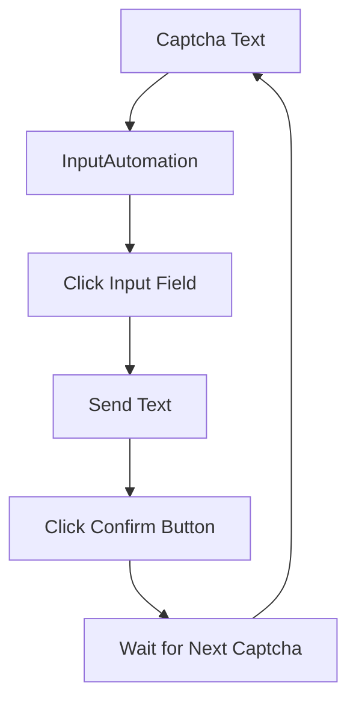

# 🔄 Phân Tích Workflow Dự Án Langla-Duky

## 📊 Tổng Quan Dự Án

**Langla-Duky** là một công cụ tự động hóa giải CAPTCHA cho game "Làng Lá Duke" với kiến trúc phức tạp và nhiều tính năng nâng cao.

## 🏗️ Kiến Trúc Hệ Thống

### 1. **Entry Point & Configuration**
```
Program.cs → MainForm.cs → config.json
```
- **Program.cs**: Entry point với nhiều test modes
- **MainForm.cs**: UI chính với 2328 dòng code
- **config.json**: Cấu hình toàn bộ hệ thống

### 2. **Core Components**

#### **A. Game Window Management**
- `GameWindow.cs`: Quản lý cửa sổ game
- `WindowFinder.cs`: Tìm và chọn cửa sổ game
- `GameWindowSelector.cs`: UI chọn cửa sổ

#### **B. Screen Capture & Image Processing**
- `ScreenCapture.cs`: Chụp màn hình game window
- `ManualCaptchaCapture.cs`: Chụp thủ công vùng captcha
- `AutoCaptchaROIDetector.cs`: Tự động phát hiện vùng captcha

#### **C. Captcha Processing Engine**
- `GameCaptchaSolver.cs`: Engine chính xử lý captcha (2715 dòng)
- `CaptchaImageProcessor.cs`: Xử lý hình ảnh captcha
- `Captcha4DigitProcessor.cs`: Xử lý captcha 4 ký tự

#### **D. OCR & AI Services**
- `TesseractCaptchaReader.cs`: OCR local với Tesseract
- `MockTesseractCaptchaReader.cs`: Mock service cho testing
- Integration với CapSolver AI (cloud service)

#### **E. Automation & Input**
- `InputAutomation.cs`: Tự động nhập text và click
- `CaptchaAutomationService.cs`: Service tự động hóa chính

#### **F. Monitoring Systems**
- `CaptchaMonitorService.cs`: Monitor real-time
- `FileBasedCaptchaMonitor.cs`: Monitor qua file system
- `CaptchaMonitoringIntegration.cs`: Tích hợp UI monitoring

#### **G. Template & Detection**
- `CaptchaTemplateManager.cs`: Quản lý template captcha
- `CaptchaTemplateCapture.cs`: Chụp template
- `ImageComparisonDetector.cs`: So sánh hình ảnh
- `SmartCaptchaDetector.cs`: Phát hiện thông minh

## 🔄 Workflow Chính

### **Phase 1: Initialization**


### **Phase 2: Captcha Detection**


### **Phase 3: Image Processing**


### **Phase 4: OCR Processing**


### **Phase 5: Result Processing**


### **Phase 6: Automation**


## 🎯 Monitoring Systems

### **1. Real-time Monitoring**
- **CaptchaMonitorService**: Monitor liên tục game window
- **Auto-detection**: Tự động phát hiện captcha xuất hiện
- **Auto-processing**: Tự động xử lý và nhập captcha

### **2. File-based Monitoring**
- **FileBasedCaptchaMonitor**: Monitor thư mục `capture-compare`
- **Image Processing**: Xử lý hình ảnh từ file system
- **Batch Processing**: Xử lý nhiều hình ảnh cùng lúc

### **3. Template-based Detection**
- **CaptchaTemplateManager**: Quản lý template captcha
- **ImageComparisonDetector**: So sánh với template
- **Smart Detection**: Phát hiện thông minh dựa trên pattern

## 🔧 Configuration System

### **config.json Structure**
```json
{
  "GameWindowTitle": "Duke Client - By iamDuke",
  "UseManualCapture": false,
  "CaptchaArea": { "X": 0, "Y": 0, "Width": 20, "Height": 6 },
  "InputFieldPosition": { "X": 640, "Y": 430 },
  "ConfirmButtonPosition": { "X": 640, "Y": 510 },
  "AutoDetectCaptchaArea": true,
  "OCRSettings": {
    "TessdataPath": "./tessdata",
    "Language": "eng",
    "CharWhitelist": "abcdefghijklmnopqrstuvwxyzABCDEFGHIJKLMNOPQRSTUVWXYZ0123456789"
  },
  "AutomationSettings": {
    "DelayBetweenAttempts": 2000,
    "DelayAfterInput": 500,
    "DelayAfterClick": 300,
    "MaxRetries": 3
  },
  "FileBasedMonitoring": {
    "Enabled": false,
    "ImageFolderPath": "capture-compare",
    "MonitoringInterval": 2000,
    "MoveProcessedImages": true,
    "ProcessedFolderName": "processed"
  }
}
```

## 🚀 Performance & Optimization

### **Processing Speed**
- **Local OCR**: <500ms per captcha
- **Cloud AI**: 1-3 seconds per captcha
- **Success Rate**: 70-95% depending on method

### **Optimization Features**
- **Multiple Preprocessing Methods**: 6 different approaches
- **Multiple PSM Modes**: 4 different OCR modes
- **Voting System**: Best result selection
- **Confidence Scoring**: Quality assessment
- **Early Termination**: Stop on good results
- **Fallback System**: Local → Cloud AI

## 🎮 UI Components

### **Main Controls**
- **Game Window Selection**: Chọn cửa sổ game
- **Captcha Area Setup**: Thiết lập vùng captcha
- **Input/Button Positions**: Thiết lập vị trí input
- **Start/Stop Controls**: Điều khiển chính

### **Monitoring Panels**
- **Real-time Monitoring**: Panel monitor real-time
- **File-based Monitoring**: Panel monitor file system
- **Template Management**: Panel quản lý template
- **Debug Tools**: Công cụ debug và test

### **Status & Logging**
- **Real-time Status**: Trạng thái hiện tại
- **Performance Stats**: Thống kê hiệu suất
- **Debug Output**: Log chi tiết
- **Image Preview**: Xem trước hình ảnh

## 🔍 Debug & Testing

### **Debug Features**
- **Debug Image Saving**: Lưu hình ảnh debug
- **Step-by-step Processing**: Xử lý từng bước
- **Confidence Tracking**: Theo dõi độ tin cậy
- **Method Comparison**: So sánh các phương pháp

### **Test Modes**
- **Simple Test**: Test cơ bản
- **Direct Test**: Test trực tiếp
- **Quick Test**: Test nhanh
- **OCR API Test**: Test API OCR
- **Full Workflow Test**: Test toàn bộ workflow

## 📁 File Structure

```
langla-duky/
├── MainForm.cs                    # UI chính (2328 dòng)
├── Program.cs                     # Entry point
├── config.json                    # Cấu hình
├── Models/                        # Core components
│   ├── GameCaptchaSolver.cs      # Engine chính (2715 dòng)
│   ├── CaptchaMonitorService.cs  # Monitor real-time
│   ├── FileBasedCaptchaMonitor.cs # Monitor file system
│   ├── AutoCaptchaROIDetector.cs # Auto detection
│   ├── InputAutomation.cs        # Tự động hóa input
│   ├── ScreenCapture.cs          # Chụp màn hình
│   └── ...                       # Các component khác
├── tessdata/                      # Tesseract data
├── captcha_debug/                 # Debug images
├── capture-compare/               # File monitoring
└── ...                           # Các file khác
```

## 🎯 Key Features

### **1. Multi-Method Processing**
- 6 preprocessing methods
- 4 OCR modes
- Voting system for best result
- Confidence-based selection

### **2. Dual Monitoring**
- Real-time window monitoring
- File-based batch processing
- Template-based detection
- Smart captcha detection

### **3. Robust Automation**
- Auto-detection of captcha area
- Auto-input of solved text
- Auto-click confirmation
- Error handling and retry

### **4. Advanced Debugging**
- Step-by-step processing
- Debug image saving
- Performance metrics
- Detailed logging

### **5. Flexible Configuration**
- JSON-based configuration
- Runtime parameter adjustment
- Multiple detection modes
- Customizable thresholds

## 🔄 Workflow Summary

**Langla-Duky** sử dụng một workflow phức tạp với nhiều lớp xử lý:

1. **Detection** → Auto/Manual/File-based detection
2. **Processing** → 6 preprocessing methods + 4 OCR modes
3. **Validation** → Voting system + confidence scoring
4. **Automation** → Auto-input + auto-click
5. **Monitoring** → Continuous monitoring + event handling

Hệ thống được thiết kế để đạt độ chính xác cao (70-95%) với tốc độ xử lý nhanh (<500ms local, 1-3s cloud) và khả năng tự động hóa hoàn toàn.
